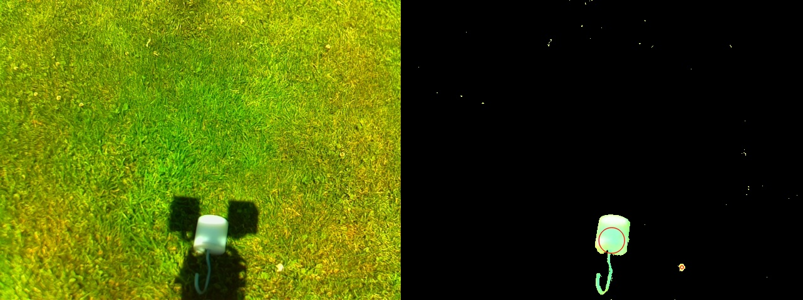
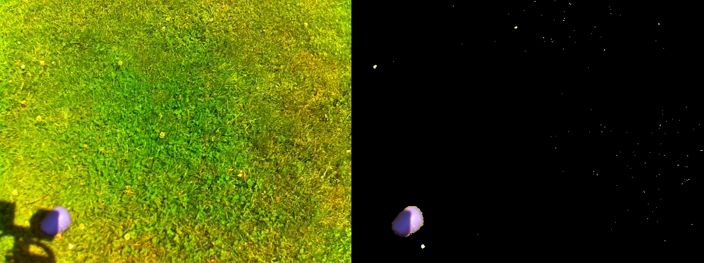

# srrc_simple_obj_detector

Simplest object detector.
It turns out that the following simple function is already a good detector for srrc samples we have:

  ```C++
  cv::Mat makeObjectMask( cv::Mat const& src_bgr_image
                        , int saturation_threshold = 168
                        , int brightness_threshold = 20)
  {
    cv::Mat hsv_image = src_bgr_image.clone();
    cv::cvtColor(hsv_image, hsv_image, cv::COLOR_BGR2HSV);
    std::vector<cv::Mat> hsv_channels;
    cv::split(hsv_image, hsv_channels);
    return (hsv_channels[1] < saturation_threshold) & (hsv_channels[2] >= brightness_threshold);
  }
  ```    


## Examples of results:
every blob that's not exactly black is an object candidate. no farther filtering used.




## Using for processing jpg files:

0. check out this repo into your catkin_ws and `catkin_make`
1. open file `test_simple_detector_node.launch`
2. replace the value for parameter `src_image_src_folder` with path to your folder containing jpg files
3. replace the value for parameter `output_folder` with the path you want to output the processed images to (it will be created if it does not exist). Everytime you run this node in this folder will be automatically created a subfolder with the name generated from timestamp where the result images are output, so it's ok to specify the value for `output_folder` only once and then use it unchanged.
4. call `roslaunch srrc_simple_obj_detector test_simple_detector_node.launch` and wait.

## Using for processing videostream:

0. check out this repo into your catkin_ws and `catkin_make`
1. open file `simple_detector_node.launch`
2. replace the value for parameter `input_image_topic` with the name of your image topic
3. if the image topic is publishing uncompressed images set the value for parameter `input_image_transfer_hint` to 'raw'
4. call `roslaunch srrc_simple_obj_detector simple_detector_node.launch`
5. call `rqt_image_view' (f.e.) to see the published processed images.
